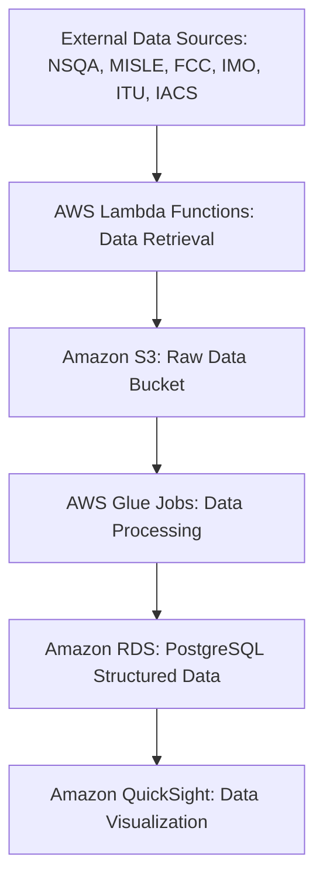

```mermaid
flowchart TD
    A[External Data Sources: NSQA, MISLE, FCC, IMO, ITU, IACS]
    B[AWS Lambda Functions: Data Retrieval]
    C[Amazon S3: Raw Data Bucket]
    D[AWS Glue Jobs: Data Processing]
    E[Amazon RDS: PostgreSQL Structured Data]
    F[Amazon QuickSight: Data Visualization]

    A --> B
    B --> C
    C --> D
    D --> E
    E --> F
```
