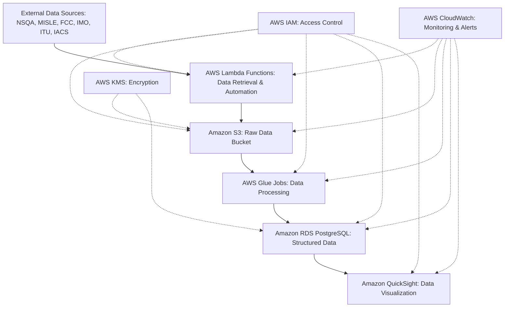

```mermaid
flowchart TD
    EXTERNAL[External Data Sources: NSQA, MISLE, FCC, IMO, ITU, IACS]
    LAMBDA[AWS Lambda Functions: Data Retrieval & Automation]
    S3[Amazon S3: Raw Data Bucket]
    GLUE[AWS Glue Jobs: Data Processing]
    RDS[Amazon RDS PostgreSQL: Structured Data]
    QUICKSIGHT[Amazon QuickSight: Data Visualization]
    IAM[AWS IAM: Access Control]
    KMS[AWS KMS: Encryption]
    CW[AWS CloudWatch: Monitoring & Alerts]

    EXTERNAL --> LAMBDA
    LAMBDA --> S3
    S3 --> GLUE
    GLUE --> RDS
    RDS --> QUICKSIGHT

    %% Security and Monitoring applies to all major services
    IAM -.-> LAMBDA
    IAM -.-> S3
    IAM -.-> GLUE
    IAM -.-> RDS
    IAM -.-> QUICKSIGHT

    KMS -.-> S3
    KMS -.-> RDS

    CW -.-> LAMBDA
    CW -.-> S3
    CW -.-> GLUE
    CW -.-> RDS
    CW -.-> QUICKSIGHT
```
